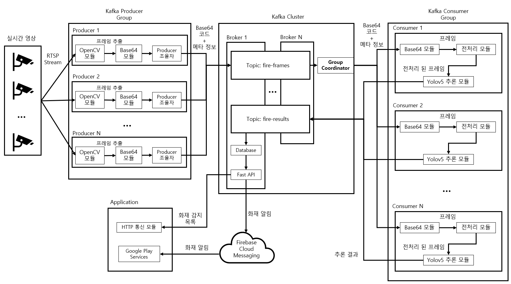

<div align="center">

# fireDetection

### Kafka 기반 분산 처리 구조
### **CCTV 실시간 화재 · 연기 감지 시스템**

<br/>

<p>
  
  
  
  
  
</p>

<p>
  
  
  
  
</p>

</div>

---

## Overview

`fireDetection`은 **분산처리 기반 CCTV 화재 감지 시스템 개발: Kafka를 활용한 실시간 영상 분석**을 주제로 구현한 프로젝트다.

이 프로젝트는 RTSP 기반 CCTV 영상으로부터 프레임을 추출하고, Kafka를 통해 프레임을 분산 전달한 뒤, PyTorch 기반 YOLOv5 모델로 화재와 연기를 탐지한다. 탐지 결과는 SQLite에 저장되며, FastAPI를 통해 조회하고 Android 애플리케이션에서 감지 이력과 알림을 확인할 수 있다.

### At a Glance

<div align="center">

| Area | Responsibility |
|---|---|
| 🎥 Video Ingestion | RTSP + OpenCV |
| 📨 Stream Transport | Apache Kafka |
| 🔍 Detection | PyTorch + YOLOv5 |
| 💾 Result Handling | SQLite + FastAPI |
| 📱 Client | Android + FCM |

</div>

---

## Architecture Summary

현재 구조는 **RTSP 입력 → Kafka 프레임 전송 → YOLOv5 탐지 → 결과 저장/조회/알림** 흐름으로 구성되어 있다.



핵심은 영상 프레임 전달과 분석 단계를 Kafka 기반 비동기 구조로 분리해, 실시간 처리와 병렬 확장이 가능하도록 구성한 점이다.

---

## Thesis

- [Bachelor Thesis PDF](./docs/thesis/bachelor-thesis.pdf)

---

## Responsibilities

### 1) RTSP Frame Producer

- CCTV 영상 스트림 수신
- OpenCV 기반 프레임 추출
- JPEG 및 base64 기반 메시지 생성
- `fire-frames` 토픽 전송

### 2) Kafka Consumer + YOLOv5 Detection

- `fire-frames` 토픽 구독
- 프레임 디코딩 및 전처리
- YOLOv5 기반 화재·연기 객체 탐지
- 바운딩 박스가 반영된 결과 생성
- `fire-results` 토픽 전송

### 3) Result Saver

- 감지 결과 수신
- SQLite 저장
- Firebase Cloud Messaging 기반 알림 전송

### 4) API Server

- 저장된 감지 결과 조회
- `/fires` API 제공
- 이미지 데이터를 base64 형태로 응답

### 5) Android Application

- 감지 이력 조회
- 감지 결과 리스트 표시
- FCM 알림 수신

---

## Kafka Topics

<div align="center">

| Type | Topic |
|---|---|
| 📥 Consumed | `fire-frames` |
| 📤 Produced | `fire-results` |

</div>

---

## Repository Structure

```text
.
|-- configs/
|-- models/
|-- scripts/
|   `-- utils/
|-- src/
|   |-- android/
|   |   `-- APP/
|   `-- python/
|       |-- api/
|       |-- classification/
|       |-- pipeline/
|       `-- producers/
|-- yolov5/
|-- .gitignore
`-- README.md
```

### Key Paths

| Path | Description |
|---|---|
| `src/python/producers/` | RTSP, 이미지, 영상 입력 전송 스크립트 |
| `src/python/pipeline/` | Kafka Consumer, 탐지 파이프라인, 결과 저장 |
| `src/python/api/` | FastAPI 조회 서버 |
| `src/android/APP/` | Android 애플리케이션 소스 |
| `models/` | 대표 가중치 파일 |
| `configs/data.yaml` | 데이터 설정 파일 |
| `yolov5/` | YOLOv5 코드 |

---

## Included Weights

- `models/best.pt`
- `models/best_fire_img_classifier_acc96.10.pth`

---

## Evaluation Summary

객체 탐지 성능 평가에서 전체 클래스 기준 결과는 다음과 같다.

| Metric | Value |
|---|---|
| Precision | 0.889 |
| Recall | 0.870 |
| mAP@0.5 | 0.899 |
| mAP@0.5:0.95 | 0.674 |

클래스별 결과는 다음과 같다.

| Class | Precision | Recall | mAP@0.5 | mAP@0.5:0.95 |
|---|---:|---:|---:|---:|
| 연기(sm) | 0.887 | 0.856 | 0.876 | 0.635 |
| 화재(fl) | 0.891 | 0.884 | 0.922 | 0.713 |

Kafka 기반 처리 흐름 테스트에서는 단일 Consumer 환경과 병렬 Consumer 환경을 비교했으며, 병렬 Consumer 구성 이후 지연 시간이 30~50ms 수준으로 안정화되고 전체 FPS가 25 이상으로 증가했다.

---

## Excluded From Repository

GitHub 공개를 위해 다음 항목은 저장소에서 제외했다.

- 테스트 이미지와 테스트 영상
- 입력 영상과 출력 영상
- 데이터 폴더
- 로컬 Kafka 설치 파일과 로그
- SQLite DB 파일
- Firebase 서비스 계정 파일
- 토큰 파일
- 중간 학습 가중치
- LSTM 관련 실험 스크립트
- Android 빌드 산출물과 로컬 설정 파일
